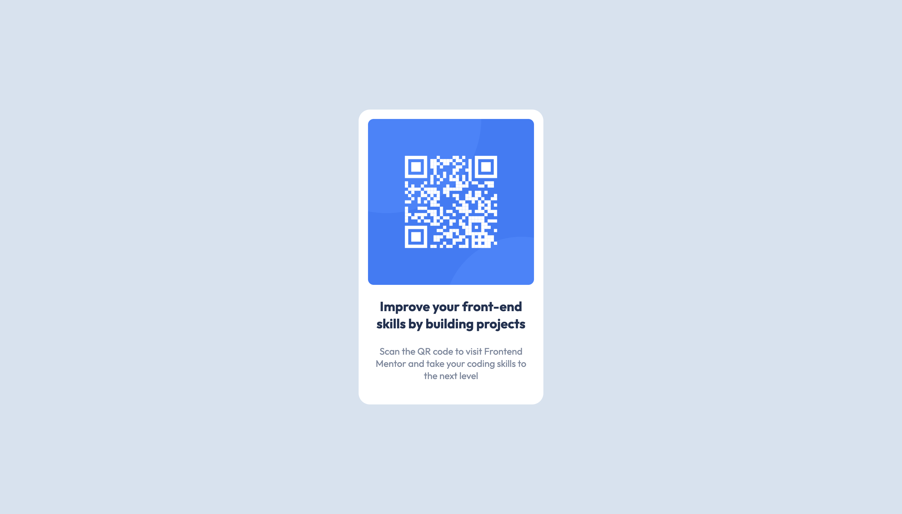

# Frontend Mentor - QR code component solution

This is a solution to the [QR code component challenge on Frontend Mentor](https://www.frontendmentor.io/challenges/qr-code-component-iux_sIO_H). Frontend Mentor challenges help you improve your coding skills by building realistic projects.

## Table of contents

- [Overview](#overview)
  - [Screenshot](#screenshot)
    - [Mobile](#mobile)
    - [Desktop](#desktop)
  - [Links](#links)
- [My process](#my-process)
  - [Built with](#built-with)
  - [What I learned](#what-i-learned)
  - [Useful resources](#useful-resources)
- [Author](#author)
- [Acknowledgments](#acknowledgments)

## Overview

### Screenshot

#### Mobile


#### Desktop



### Links

- Solution URL: [https://www.frontendmentor.io/solutions/qr-code-component-using-css-custom-properties-and-flex-box-yEHgQBrqaG](https://www.frontendmentor.io/solutions/qr-code-component-using-css-custom-properties-and-flex-box-yEHgQBrqaG)
- Live Site URL: [https://wesselkonstantinov.github.io/qr-code-component/](https://wesselkonstantinov.github.io/qr-code-component/)

## My process

### Built with

- Semantic HTML5 markup
- CSS custom properties
- Flexbox
- Mobile-first workflow

### What I learned

Including a modern css reset at the start of the stylesheet helps with setting up sensible cross-browser default styles. For example:

```css
img,
picture {
  max-width: 100%;
  display: block;
}
```

Setting img elements to display block and max-width 100% makes them easier to work with. The only other style I needed to add to the image in the QR code component was a border radius to match the design.

### Useful resources

- [A Modern CSS Reset](https://andy-bell.co.uk/a-modern-css-reset/) - This helped me with the cross-browser default styles.

## Author

- Website - [Wessel Konstantinov](https://github.com/WesselKonstantinov)
- Frontend Mentor - [@WesselKonstantinov](https://www.frontendmentor.io/profile/WesselKonstantinov)

## Acknowledgments

I drew inspiration from the feedback [Grace Snow](https://www.frontendmentor.io/profile/grace-snow) provided to others who worked on the same project, like including a modern CSS reset and using landmark elements such as `<main>`.
